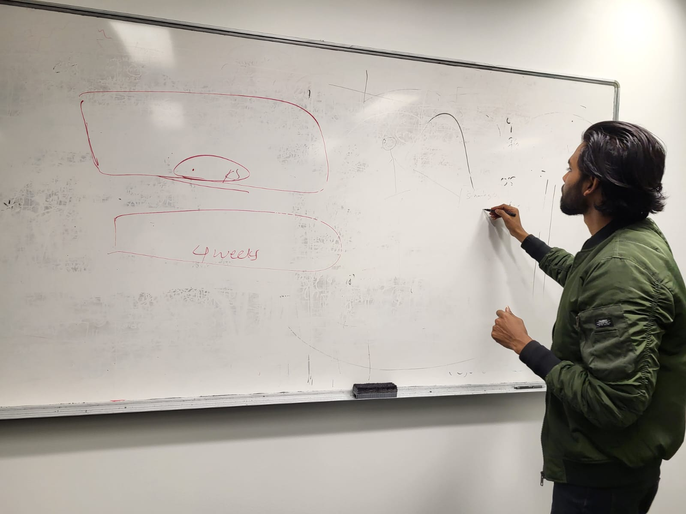
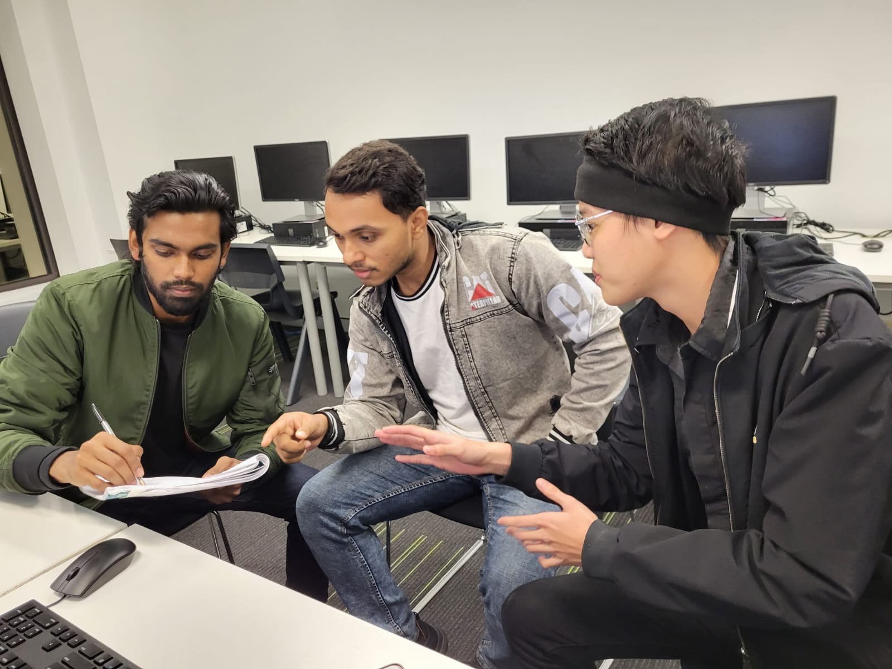

# ePortfolio
Wk8 ePortfolio slides
<html>
<head>
  <body>
    <h3> Communication concepts and strategies </h3>
    
 Communication is the exchange of information between a sender and a receiver. It used to be that you only had to worry about the way you communicated face-to-face or on paper. Technology has changed this completely. It is important for people to take into account every aspect of how they are relaying information. This is where communication strategies come into play. 
  
      
 There are so many types of communication strategies: such as, nonverbal communication, verbal ommunication,visual communication. 

    <h3> Show confidence and skills in oral communication and presentations</h3>
      
 Last couple of weeks ago I gave a presentation a my university and also it's shows my confidence and oral communication skills. This oral communication skills is really important for our working life. If we dont have the basic communication skills then it will be really hard in this fast going generation. Besids, we also need the confidence in our self. Which can be grow by self grooming on our specific field.
          Here is the evidence that I attended the last week presentation:
          
    <h3> Work effectively as a part of a team </h3>
      
The only focus of the team should be their set common goals and all the members should be dedicated. When I was at my team I was always ddicated towards my woks.There are few things which plays significate role into our team work. One of them is effective communication. 
          
 Now I will show a picture of my team work where we 3team members were dicussing the main isuues for our group work.
              
    <h3> Communicate effectively in a professional context </h3>
    <h3> Define and demonstrate conflit management and resolution strategies </h3>
  </body>
 </head>
  </html>
